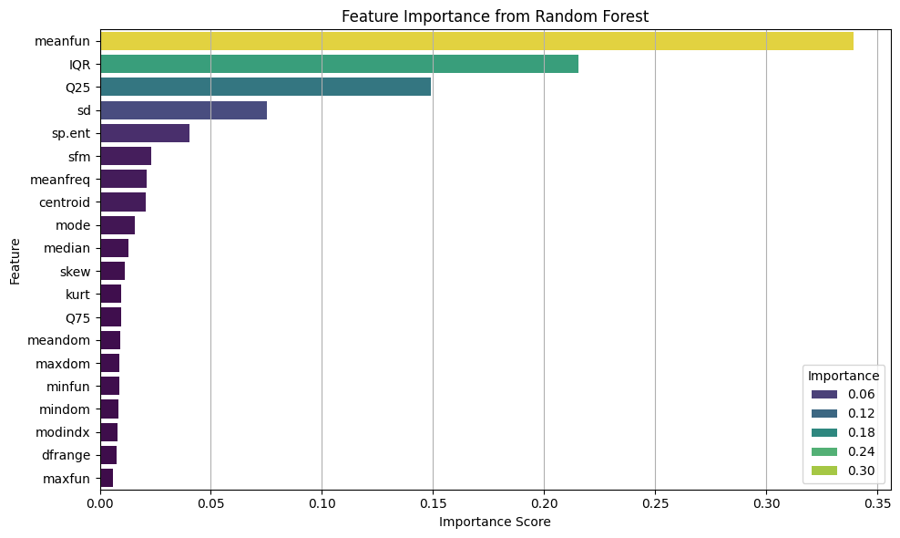
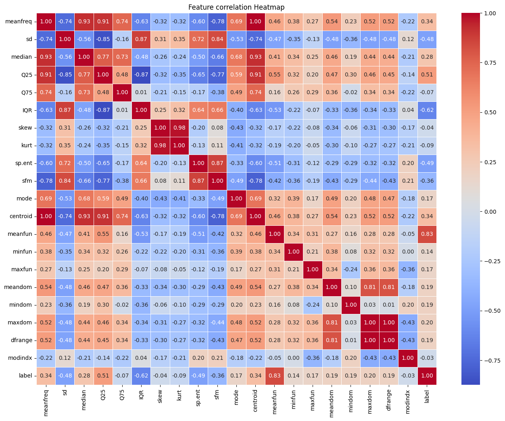
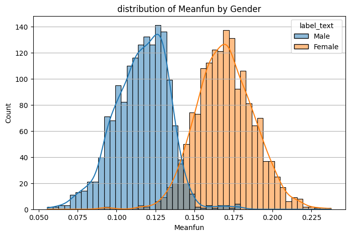
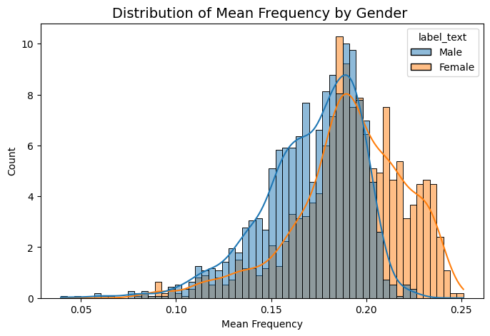
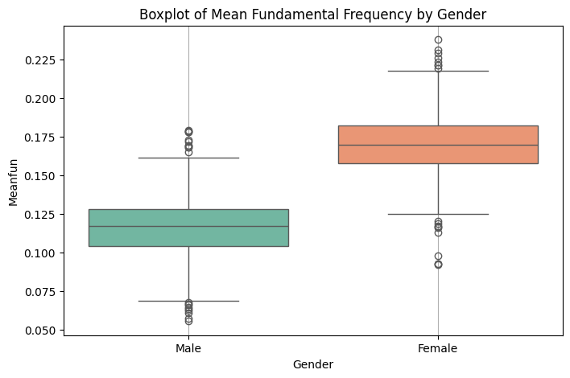
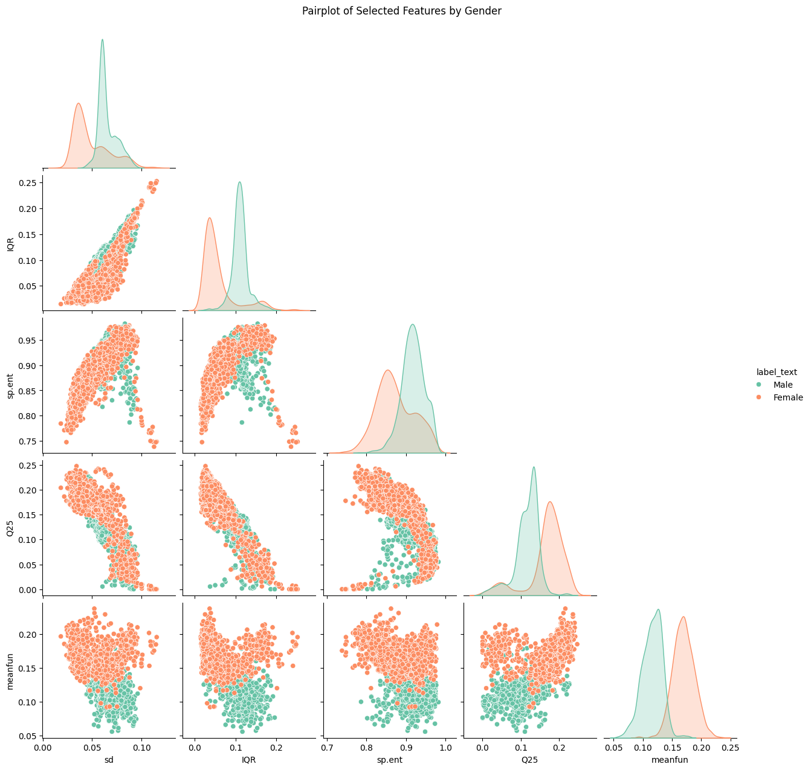

# Voiceprint: Can We Predict Gender From Sound?

This project explores whether a speaker's gender can be predicted using frequency-based audio features extracted from voice recordings. Using the Voice Gender Recognition Dataset from Kaggle, we walk through the entire data science workflow — from EDA to model deployment.

---

## 📁 Dataset

- Source: [Voice Gender Recognition Dataset on Kaggle](https://www.kaggle.com/datasets/primaryobjects/voicegender)
- Size: 3168 rows × 21 columns
- Label: Male or Female (encoded: Male = 0, Female = 1)

---

## 🧠 Project Workflow

- ✅ Data Cleaning + Preprocessing
- ✅ Label Encoding
- ✅ Exploratory Data Analysis
- ✅ Feature Selection (via heatmaps & pairplots)
- ✅ Model Training:
    - Logistic Regression
    - Random Forest Classifier
- ✅ Model Evaluation
- ✅ Feature Importance Plot

---

## 🔥 Results

| Model               | Accuracy |
|--------------------|----------|
| Logistic Regression| 93%      |
| Random Forest      | **98%**  |

Top Feature: `meanfun` (mean frequency of voice)

---

## 📊 Visuals

### 📈 Feature Importance  


### 🔥 Heatmap  


### 📊 Histogram: Meanfun  


### 📊 Histogram: Meanfreq  


### 📊 Histogram: Modindx  


### 📦 Boxplot: Meanfun  


### 🔗 Pairplot of Top Features  


---

## 💻 Tech Stack

- Python 3.x
- Pandas
- Seaborn + Matplotlib
- Scikit-learn

---

## 🚀 How to Run

```bash
pip install -r requirements.txt
jupyter notebook
```

Then open the notebook inside `/notebooks/`.

---

## 🏷️ Tags

`#DataScience` `#VoiceRecognition` `#MachineLearning` `#RandomForest` `#GenderClassification` `#PortfolioProject`

---

## 🙋‍♂️ About Me

Hi! I'm **Ritesh Manandhar**, a data science aspirant who loves turning raw data into sharp insights and machine learning models.

- 🧠 I built this project from scratch to push my skills in **EDA**, **feature selection**, and **ML modeling**.
- 🌱 Always learning, always experimenting.

📎 **Portfolio:** [bytegenosis](https://tinyurl.com/bytegenosis)  
🐙 **GitHub:** [Badbytebat](https://github.com/Badbytebat)  
🔗 **LinkedIn:** [ritesh-bytegenosis](https://www.linkedin.com/in/ritesh-bytegenosis)

---

*Thanks for checking out my work — feel free to connect!*
